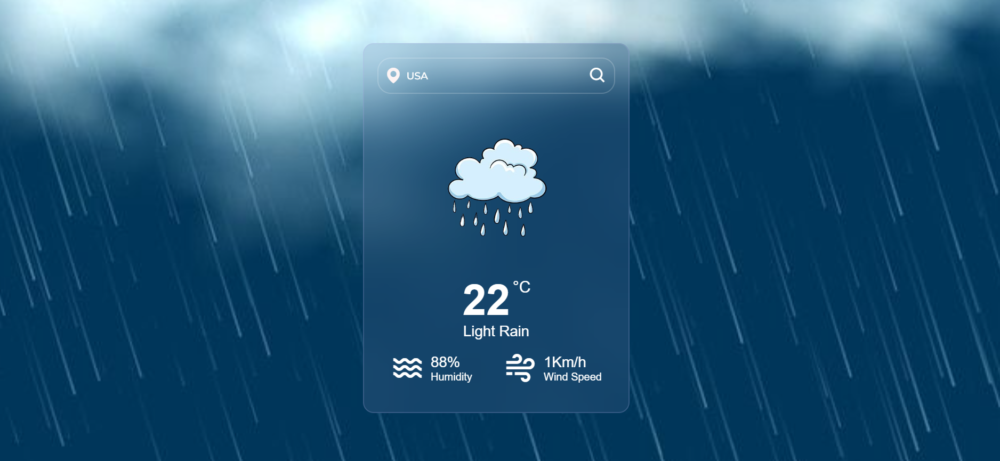
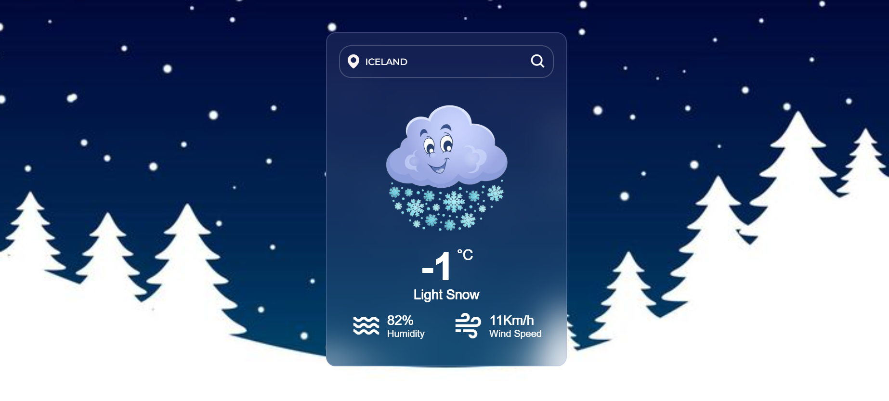

# weather-applications

## 🚀 Features
Search weather by city name
Displays temperature, weather condition, humidity, and wind speed
Real-time data from OpenWeatherMap API
Responsive layout for mobile and desktop
Error handling for invalid city names

## 🛠️ Tech Stack
Frontend: HTML5, CSS3, JavaScript (Vanilla)
API: OpenWeatherMap API
Deployment: GitHub Pages

## 📸 Screenshots

